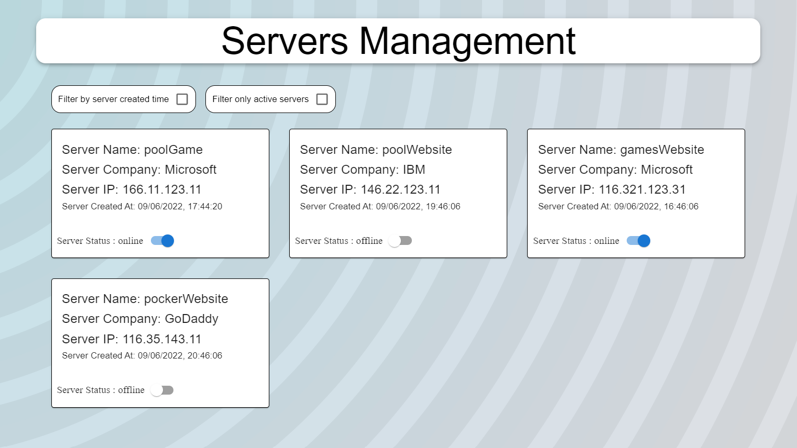

# Servers Management

## About The Project:
In my project you can manage your DataBase (in my example: servers management).
For example you can: 
* see all the active servers
* filter by the server creation date

## Images



## Technologies I used:
* React
* Node-JS
* MySQL

## Getting Started

### Installing

git clone my reposetory to your local folder.

### Executing program

* Docker:
open new terminal and run the following commands: 
  ```
  cd dev-apps
  docker compose up
  ```
* npm:
  make sure to install node modules in each client and server folders
  ```
  cd client
  npm install 
  ```
  ```
  cd server
  npm install 
  ```
* starting the project:  
  * open new terminal and run the following commands: 
    ```
    cd server
    npm run all-slim
    ```
  * open another terminal and run the following commands: 
    ```
    cd client
    npm start
    ```

## Help

If you running into a docker problem, check if the port 3306 of MySQL is available.
```
cd dev-apps
docker compose down 
```
after you make sure the port is available, run the following command in the dev-apps folder: 
```
cd dev-apps
docker compose up 
```

## Authors

Ziv Ashkenazi 
[@Linkdin](https://www.linkedin.com/in/ziv-ashkenazi/)